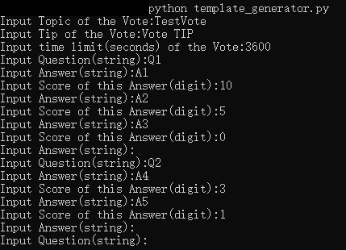
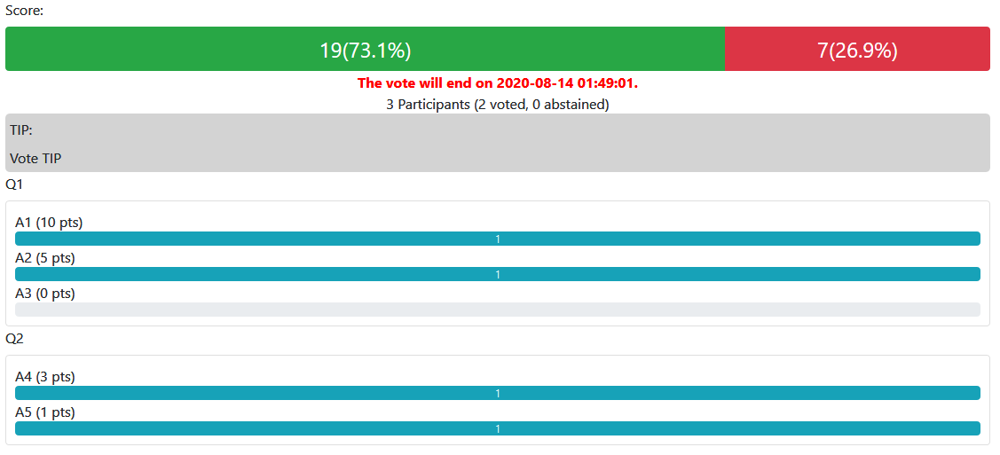

# EasyVote

> Make a Once-Per-Person vote with flex and ease. (Web service based on flask)

## Usage
1. Generate a template
```shell
python template_generator.py
```
Take file "sample_template.txt" as an example, we input as below:



So content of the file "sample_template.txt" generated is:
```json
{
	"Topic": "TestVote",
	"Tip": "Vote TIP",
	"TimeLimit": "3600",
	"Questions": [{
		"Question": "Q1",
		"Answers": [{
			"Answer": "A1",
			"Score": 10
		}, {
			"Answer": "A2",
			"Score": 5
		}, {
			"Answer": "A3",
			"Score": 0
		}]
	}, {
		"Question": "Q2",
		"Answers": [{
			"Answer": "A4",
			"Score": 3
		}, {
			"Answer": "A5",
			"Score": 1
		}]
	}]
}
```
2. Run server
```shell
python vote.py -i INPUT -n NVOTERS -p PORT

optional arguments:

  -h, --help            show this help message and exit

  -i INPUT, --input INPUT
                        Input questions file.

  -n NVOTERS, --nvoters NVOTERS
                        Count of voters.

  -p PORT, --port PORT  Port of server.
```
3. Vote
"vote.py" will generate a file "VoteGUID.txt" which list all GUIDs for users.
Visit URL below to check vote result:
```
http://[Domain Name or IP Address]:[Port you set]/
Eg: http://localhost:5555/
```


Visit URL below to vote:
```
http://[Domain Name or IP Address]:[Port you set]/[GUID]
Eg: http://localhost:5555/00c57f5a-a3e1-11ea-b270-b025aa18fa9c
```


**Requirements:**
Python 3.x, flask